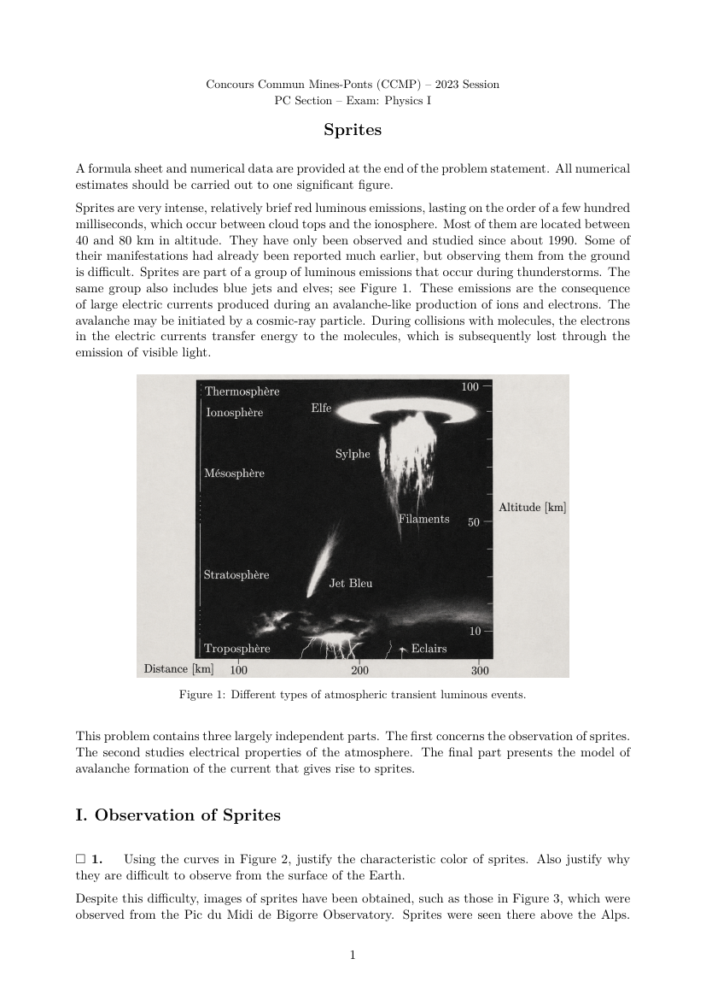

# CCMP 2023 Physics I - Sprites

Materials for the Concours Commun Mines-Ponts (CCMP) 2023 Physics I exam,
PC track.

The exam topic is **Les sylphes**, translated here as **Sprites**:
atmospheric transient luminous events (TLEs) connected to thunderstorms,
electric fields in the atmosphere, the ISS, and avalanche ionization.

## English Exam Preview

Click the preview to open the cleaned English exam PDF.

## Top-Level Deliverables

- `TLE_Exam_fr.pdf` - cleaned French rebuild of the exam statement.
- `TLE_Exam_en.pdf` - cleaned English translation/rebuild of the exam statement.
- `TLE_Exam_solution_updated.pdf` - updated checked LaTeX solution PDF.
- `assets/TLE_Exam_en_preview.png` - first-page preview image for the English PDF.
- `README.md` - this inventory and context file.

## Original Scan

- `original_scanned/TLE_Exam.pdf` - original scanned French exam statement.

## Cleaned Exam Workspace

- `TLE_exam_clean/TLE_Exam_fr.tex` - French LaTeX source.
- `TLE_exam_clean/TLE_Exam_en.tex` - English LaTeX source.
- `TLE_exam_clean/TLE_Exam_fr.pdf` - cleaned French PDF built from the source.
- `TLE_exam_clean/TLE_Exam_en.pdf` - cleaned English PDF built from the source.
- `TLE_exam_clean/figures/` - higher-quality PNG figures kept as source material.
- `TLE_exam_clean/figures_compressed/` - compressed JPEG figures used by the rebuilt PDFs.
- `TLE_exam_clean/ocr_output/` - OCR and page-extraction intermediates.
- `TLE_exam_clean/scripts/` - helper scripts used during cleanup and verification.

## Updated Solution Workspace

- `TLE_exam_clean/TLE_Exam_solution_updated.tex` - LaTeX source for the updated checked solution.
- `TLE_exam_clean/TLE_Exam_solution_updated.pdf` - PDF built from the solution source.
- `TLE_exam_clean/TLE_Exam_solution_updated.*` - LaTeX auxiliary build outputs.

## Notes

The cleaned PDFs are intended to be easier to read and reuse than the original
scanned PDF while preserving the structure of the exam: observation of
sprites, electrical properties of the atmosphere, and the avalanche model for
sprite formation.

The top-level PDFs are the convenient files to open first. The `TLE_exam_clean/`
folder keeps the source material and intermediate files used to rebuild or
check them.

The top-level exam and solution PDFs use the compressed JPEG figures so the
three main PDFs remain below 7 MB combined. The higher-quality PNG figure set is
kept separately in `TLE_exam_clean/figures/`.
